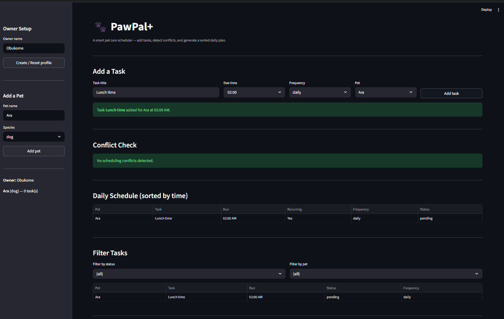

# PawPal+ (Module 2 Project)

You are building **PawPal+**, a Streamlit app that helps a pet owner plan care tasks for their pet.

## Scenario

A busy pet owner needs help staying consistent with pet care. They want an assistant that can:

- Track pet care tasks (walks, feeding, meds, enrichment, grooming, etc.)
- Consider constraints (time available, priority, owner preferences)
- Produce a daily plan and explain why it chose that plan

Your job is to design the system first (UML), then implement the logic in Python, then connect it to the Streamlit UI.

## What you will build

Your final app should:

- Let a user enter basic owner + pet info
- Let a user add/edit tasks (duration + priority at minimum)
- Generate a daily schedule/plan based on constraints and priorities
- Display the plan clearly (and ideally explain the reasoning)
- Include tests for the most important scheduling behaviors

## Getting started

### Setup

```bash
python -m venv .venv
source .venv/bin/activate  # Windows: .venv\Scripts\activate
pip install -r requirements.txt
```

### Suggested workflow

1. Read the scenario carefully and identify requirements and edge cases.
2. Draft a UML diagram (classes, attributes, methods, relationships).
3. Convert UML into Python class stubs (no logic yet).
4. Implement scheduling logic in small increments.
5. Add tests to verify key behaviors.
6. Connect your logic to the Streamlit UI in `app.py`.
7. Refine UML so it matches what you actually built.

## Features

- **Owner & pet profiles** — Create an owner, add multiple pets (dog, cat, rabbit, bird, etc.), and manage them from a persistent sidebar.
- **Task management** — Add named care tasks (walks, feeding, meds, grooming, etc.) to any pet with a due time and optional recurrence frequency.
- **Sorting by time** — All tasks across every pet are sorted chronologically by time-of-day, giving a clean daily view regardless of which pet a task belongs to.
- **Conflict warnings** — The scheduler automatically detects when two or more tasks are scheduled at the exact same minute and surfaces a human-readable warning for each conflict.
- **Daily & weekly recurrence** — Tasks marked `daily` or `weekly` auto-schedule their next occurrence the moment they are completed — no manual re-entry needed.
- **Filter by status or pet** — Narrow the task list to `pending` or `done` tasks, limit results to a single pet, or combine both filters at once.
- **Mark complete** — Mark any pending task done directly from the UI; recurring tasks immediately generate their next occurrence in the schedule.

## Smarter Scheduling

The `Scheduler` class has been extended with four algorithmic features:

**Sort by time** (`sort_by_time`)
All tasks across every pet are ordered by time-of-day using a lambda that formats `due_date` as an `"HH:MM"` string. This surfaces the daily routine pattern regardless of which calendar date a task falls on.

**Filter tasks** (`filter_tasks`)
Tasks can be narrowed by completion status (`"pending"` / `"done"`), by pet name, or both at once. Both parameters are optional — omitting one skips that filter entirely.

**Auto-rescheduling** (`Task.frequency` + `Scheduler.mark_task_complete`)
Tasks now carry an optional `frequency` field (`"daily"` or `"weekly"`). When `mark_task_complete` is called, it delegates to `Task.mark_complete()`, which marks the task done and returns a new instance shifted forward by one day (`timedelta(days=1)`) or one week (`timedelta(weeks=1)`). The Scheduler then adds the new task to the correct pet automatically, keeping recurring routines alive without manual re-entry.

**Conflict detection** (`detect_conflicts`)
The scheduler groups all tasks by their exact `"YYYY-MM-DD HH:MM"` slot. Any slot with more than one task produces a human-readable warning string. The method never raises an exception — callers receive an empty list when the schedule is clean.

## Testing PawPal+

### Run the tests

```bash
python -m pytest tests/test_pawpal.py -v
```

### What the tests cover

The suite contains 32 tests organized across four areas:

**Recurrence logic** — Confirms that marking a `daily` task complete creates a new task for the following day at the same time, and that a `weekly` task advances by 7 days. Also verifies that completing a one-time task returns `None` and does not grow the pet's task list.

**Sorting correctness** — Verifies that `sort_by_time()` returns tasks in chronological time-of-day order regardless of insertion order or which calendar date a task falls on. Also checks that `get_tasks_by_date()` returns only tasks matching the queried date, sorted ascending by full datetime.

**Conflict detection** — Verifies that `detect_conflicts()` returns an empty list when no tasks overlap, produces exactly one `WARNING` string when two tasks share the same minute slot, and lists all tasks in the warning when three or more collide at the same time.

**Edge cases** — Covers a `Scheduler` with no pets, a pet with no tasks, filtering by an unknown pet name, crossing month/year boundaries during recurrence, and ensuring that both status and pet-name filters are AND-ed (not OR-ed) when combined.

### Confidence Level

★★★★☆ (4/5)

The core scheduling behaviors — recurrence, sorting, conflict detection, and filtering — are all verified and passing. One star is withheld because the current tests do not cover the Streamlit UI layer (`app.py`) or the `Owner.display_schedule()` output, leaving some user-facing paths untested.

### DEMO


